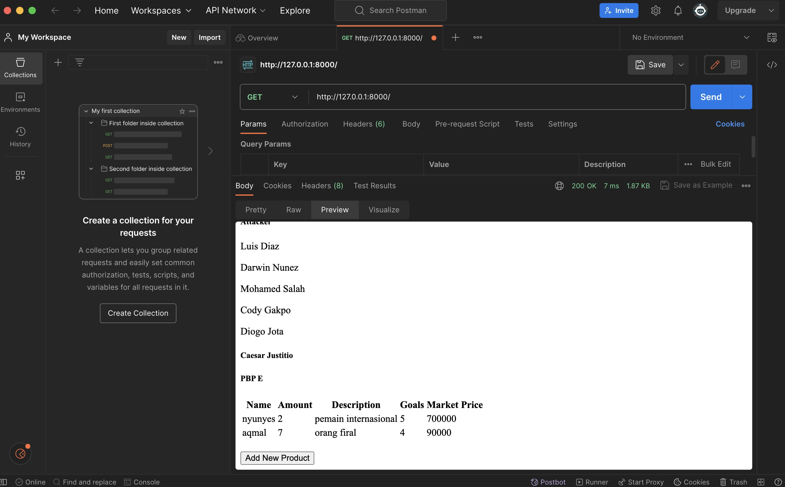
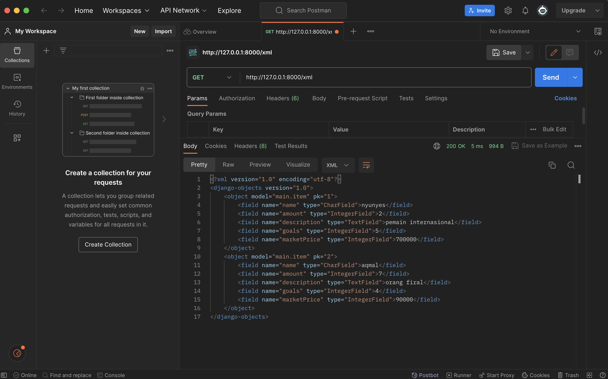
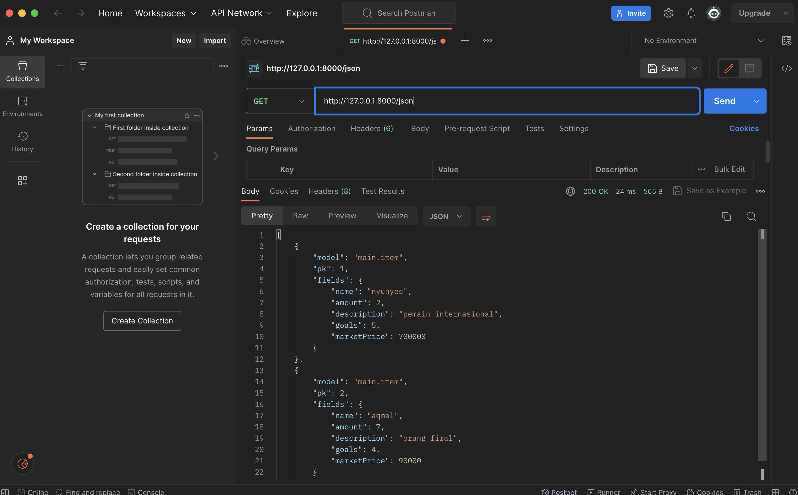
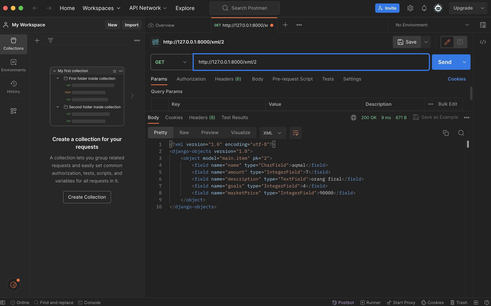
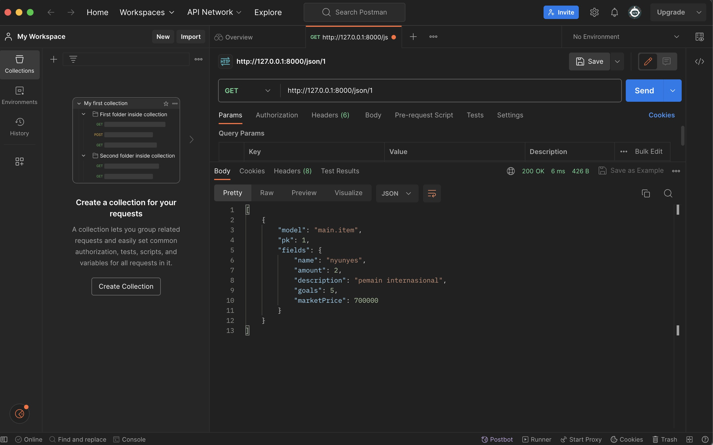

Caesar Justitio
2206082373
PBP E
Liverpoolist

- TUGAS 2

## 1. Jelaskan bagaimana cara kamu mengimplementasikan checklist di atas secara step-by-step

a. Membuat sebuah proyek 
Pertama, saya membuat repositori bernama liverpool-list di local. Lalu, saya menjalankan virtual environment pada direktori tersebut untuk mengatur package, setelah itu saya mengatur dependencies yang diperlukan di dalam file requirements.txt. Setalah itu, saya membuat proyek Django dengan cara menjalankan 'django-admin startproject liverpool_list .' pada terminal folder tersebut. Langkah terakhir adalah mengaktifkan server dengan cara menjalankan './manage.py runserver'.

b. Membuat aplikasi main
Untuk membuat aplikasi main, saya memasukkan perintah 'python manage.py startapp main' ke terminal. Lalu, saya menambahkan 'main' ke settings.py.

c. Melakukan routing
Mengatur file urls.py yang berada di direktori proyek agar bisa mengakses web dengan domains / yang kita inginkan, contoh '/main'. Routing adalah menghubungkan file kita dengan suatu domain yang kita ingin kan dengan cara menentukan app namenya yaitu 'main'.

d. Membuat model pada aplikasi main
Pada file models.py, membuat class Item dengan atribut 'name' bertipe CharField, 'amount' bertipe IntegerField, 'description' bertipe TextField, 'goals' bertipe IntegerField, dan marketPrice bertipe 'IntegerField'. Kemudian model dilakukan migrasi supaya data dapat berjalan secara konsisten.

e. Membuat sebuah fungsi pada views.py
Membuat fungsi show_main pada views.py dengan isi variable-variable yang akan ditempilkan pada main.html. Views merupakan salah satu komponen utama MVT. Pada T yaitu template, pada file main.html, kita bisa menggunakan variable yang telah didefinisikan pada views.py

f. Melakukan routing pada urls.py aplikasi main 
Mengatur file urls.py yang berada di direktori proyek agar bisa memetakan fungsi yang telah dibuat pada views.py, isi dari urls.py pada aplikasi main adalah app name dan urlpatterns yang berisi path untuk mengakses show_main.

g. Melakukan deployment ke Adaptable 
Deployment ke Adaptable dilakukan dengan cara menghubungkan repository di gihub dengan Adaptable, kita memilih main sebagai branch utama, lalu memilih mendevelop web menggunakan python environment dan PostgreSQL sebagai template data. Setalah itu Adaptable akan meminta versi python dari yang sedang berjalan di komputer kita dan akan meminta input start command untuk bisa menjalankan aplikasi, start command aplikasi yang saya buat adalah 'python manage.py migrate && gunicorn liverpool_list.wsgi'. Setelah menjalankan semua step di atas, tinggal menunggu proses deployment berjalan dan selesai.


## 2. Buatlah bagan yang berisi request client ke web aplikasi berbasis Django beserta responnya dan jelaskan pada bagan tersebut kaitan antara urls.py, views.py, models.py, dan berkas html.


a. Permintaan HTTP dari user menuju file urls.py. Dalam file ini, ada konfigurasi yang mengarahkan URL ke tampilan yang diminta. Django akan mencocokkan URL yang diterima dengan pola URL yang telah dideclare dalam file urls.py. Setelah URL cocok dengan pola yang ada dalam file tersebut, maka permintaan akan dijalankan ke tampilan yang ada dalam file views.py.

b. Akses akan diberikan dengan atribut model yang telah didefinisikan dalam file models.py. Query akan berjalan pada model-model jika data-data dibutuhkan untuk tampilan. Saat views melakukan query ke model, Django akan melakukan request kepada basis data lalu akan diterima dan diberi data yang bisa digunakan pada tampilan yang kita inginkan.

c. Setelah data berhasil direquest, html akan dirender. Outputnya akan dikirimkan sebagai respons HTTP kepada user yang akan digunakan pada browser untuk menampulkan semua elemen yang sudah kita buat.


## 3. Jelaskan mengapa kita menggunakan virtual environment? Apakah kita tetap dapat membuat aplikasi web berbasis Django tanpa menggunakan virtual environment?

Virtual environment adalah suatu workspace yang terpisah untuk proyek dari Python. Dengan menggunakan virtual environment, kita dapat menginstal dan menggunakan versi Python dan library yang berbeda untuk setiap proyek, tanpa mengganggu proyek lain, hal itu bisa sangat membantu dalam manajemen proyek yang menjadi sangat teratur. Alasan lain memakai virtual environment antara lain:
a. Proyek tidak tercampur
Dalam pengembangan sebuah proyek, bisa jadi dibutuhkan requirements yang berbeda antar proyek lainnya dan penggunaan library yang berbeda juga untuk menunjang dari masing-masing proyek yang dikerjakan, dengan menggunakan virtual environemnt kita bisa memisahkan antar proyek dengan tujuan untuk menghindari konflik dari versi pythonnya itu sendiri maupun dari library.

b. Clean management
Dengan menggunakan virtual environment, keteraturan dalam manajemen bisa dimaksimalkan yang membuat kemudahan pengembangan seluruh proyek dan menjadikan clean agar tidak terjadi kerancuan saat mengerjakan proyek bersama developer lainnya.

c. Management Dependensi
Memastikan bahwa kita menggunakan versi yang benar dari setiap paket. Karena dalam melakukan develop proyek-proyek, kita membutuhkan library atau modul pihak ketiga.


## 4. Jelaskan apakah itu MVC, MVT, MVVM dan perbedaan dari ketiganya.
MVC, MVT, dan MVVM adalah tiga model arsitektur perangkat lunak yang umum digunakan untuk pengembangan aplikasi web.
MVC (Model-View-Controller)
MVT (Model-View-Template)
MVVM (Model-View-ViewModel)

* MVC (Model-View-Controller):
Model: Mewakili data aplikasi dan logic. Model bertanggung jawab untuk mengelola data dan interaksi dengan database.
View: Menampilkan data kepada user dalam bentuk tampilan yang memungkinkan user melakukan interaksi dengan aplikasi.
Controller: Mengatur aliran informasi antara Model dan View. Controller merespons tindakan user dan memutuskan apa yang harus dilakukan berdasarkan perintah yang ada.

* MVT (Model-View-Template):
Model: Mewakili data aplikasi dan logic. Model bertanggung jawab untuk mengelola data dan interaksi dengan database.
View: Menampilkan data kepada user dalam bentuk tampilan yang memungkinkan user melakukan interaksi dengan aplikasi.
Template: Template dalam MVT adalah lapisan tampilan dan presentasi yang terpisah dari View. Template digunakan untuk mengatur tampilan data dalam halaman dari sebuah web.

* MVVM (Model-View-ViewModel):
Model: Mewakili data aplikasi dan logic. Model bertanggung jawab untuk mengelola data dan interaksi dengan database.
View: Menampilkan data kepada user dalam bentuk tampilan yang memungkinkan user melakukan interaksi dengan aplikasi.
ViewModel: Ini adalah konsep yang memungkinkan hubungan data antara Model dan View. ViewModel berisi logic untuk mengambil data dari file Model dan mengirim ke View dalam format yang siap ditampilkan.

* Perbedaan:
a. Dalam MVC, Model dan View terpisah, dan Controller bertindak sebagai penghubung di antara Model dan View. Konsep ini banyak digunakan pada pengembangan web tradisional.

b. Dalam MVT, pemisahan terjadi antara Template dan View, sementara dalam MVC, View bertanggung jawab atas tampilan dan logic presentasi dari sebuah web.

c. Dalam MVVM, hubungan data bisa terjadi dua arah antara Model dan View, fitur ini sangat berguna untuk pengembangan aplikasi yang membutuhkan otomasi tampilan saat ada perubahan pada data.


# TUGAS 3

## 1. Apa perbedaan antara form POST dan form GET dalam Django?

### POST
- Data dikirim dalam bagian permintaan HTTP
- Data tidak terlihat pada URL
- Dapat digunakan untuk mengirimkan data besar dan data sensitif

### GET
- Data dikirim dalam URL permintaan HTTP
- Data terliihat pada URL
- Tidak dapat digunakan untuk mengirimkan data besar dan data sensitif karena rawan terjadi kebocoran data sensitif dan disalahgunakan oleh orang-orang tidak bertanggund jawab

## 2. Apa perbedaan utama antara XML, JSON, dan HTML dalam konteks pengiriman data?

### XML

- Format data tekstual yang dapat dibaca oleh manusia dan mesin
- Dapat digunakan untuk beragam jenis data dan bisa digunakan untuk struktur data yang kompleks
- Dapat digunakan untuk mengirimkan data besar

### JSON

- Data text yang bisa dibaca oleh mesin
- Efisien untuk melakukan transmisi data
- Lebih mudah dilakukan pemrosesan

### HTML

- Format data mewakili halaman web
- Tidak dapat digunakan untuk data-data yang kompleks
- Tidak efisien untuk mengirimkan data yang besar

## 3. Mengapa JSON sering digunakan dalam pertukaran data antara aplikasi web modern?
Keunggulannya yang membuat JSON sering digunakan dalam pertukaran data antara aplikasi web modern karena:
- Ringkas, efisien, dan cepat
- Readable: Mudah dimengerti oleh manusia dan mesin
- Kapabiilitas: Bisa memproses beragam jenis data

## 4. Jelaskan bagaimana cara kamu mengimplementasikan checklist di atas secara step-by-step

### 1) Membuat input form untuk menambahkan objek model pada app sebelumnya.

- Membuat forms.py pada folder main dengan isian "from main.models import Item" dan dengan isi "fields = ["name", "amount", "description", "goals", "marketPrice"]" 

- Membuat fungsi create_product dalam file views.py yang bertujuan untuk membuat form yang dapat menambahkan data produk ke dalam databaser. Jangan lupa untuk menambahkan import (HttpResponseRedirect, ProductForm, dan reverse) pada line paling atas

- Memodifikasi fungsi show_main dengan menambahkan 'items': items pada context

- Menambahkan path url yang sesuai pada urls.py yaitu

```py
path('create-product', create_product, name='create_product')
```

- Membuat create_product.html pada folder templates yang ada pada folder main. Membuat tabel untuk menunjukkan data yang telah tersimpan di dalam database:

```py
 


<h1>Add New Product</h1>

<form method="POST">
    
    <table>
        {{ form.as_table }}
        <tr>
            <td></td>
            <td>
                <input type="submit" value="Add Product"/>
            </td>
        </tr>
    </table>
</form>


```

- Menambahkan kode pada file main.html untuk menampilkan data:

```py
  <table>
    <tr>
        <th>Name</th>
        <th>Amount</th>
        <th>Description</th>
        <th>Goals</th>
        <th>Market Price</th>
    </tr>

     Berikut cara memperlihatkan data produk di bawah baris ini 

    
        <tr>
            <td>{{item.name}}</td>
            <td>{{item.amount}}</td>
            <td>{{item.description}}</td>
            <td>{{item.goals}}</td>
            <td>{{item.marketPrice}}</td>
        </tr>
    
</table>

<br />

<a href="">
    <button>
        Add New Product
    </button>
</a>
```

### 2) Menambahkan 5 fungsi views untuk melihat objek dalam format HTML, XML, JSON, XML by ID, dan JSON by ID.
Saya menambahkan kode berikut dalam file views.py yang berada di main.
```py
from django.shortcuts import render
from django.http import HttpResponseRedirect, HttpResponse
from main.forms import ProductForm
from django.urls import reverse
from django.core import serializers
from main.models import Item

def show_main(request):
    items = Item.objects.all()

    context = {
        'name': 'Caesar Justitio',
        'class': 'PBP E',
        'appname': 'Liverpoolist',
        'position1': 'Goalkeeper',
        'position2': 'Defender',
        'position3': 'Midfielder',
        'position4': 'Attacker',
        'items': items
    }

    return render(request, "main.html", context)

def create_product(request):
    form = ProductForm(request.POST or None)

    if form.is_valid() and request.method == "POST":
        form.save()
        return HttpResponseRedirect(reverse('main:show_main'))

    context = {'form': form}
    return render(request, "create_product.html", context)

def show_xml(request):
    data = Item.objects.all()
    return HttpResponse(serializers.serialize("xml", data), content_type="application/xml")

def show_json(request):
    data = Item.objects.all()
    return HttpResponse(serializers.serialize("json", data), content_type="application/json")

def show_xml_by_id(request, id):
    data = Item.objects.filter(pk=id)
    return HttpResponse(serializers.serialize("xml", data), content_type="application/xml")

def show_json_by_id(request, id):
    data = Item.objects.filter(pk=id)
    return HttpResponse(serializers.serialize("json", data), content_type="application/json")
```

context bisa disesuaikan dengan keinginan pembuat

### 3) Membuat routing URL untuk masing-masing views yang telah ditambahkan pada poin 2.
Routing URL memungkinkan aplikasi untuk menghubungkan URL tertentu dengan view yang sesuai. Ketika user mengakses URL tertentu, Django akan menggunakan routing URL untuk menentukan view yang harus dipanggil. Pada file urls.py pada direktori main, saya menambahkan kode berikut:

```py
from django.urls import path
from main.views import show_main, create_product, show_xml, show_json, show_xml_by_id, show_json_by_id

app_name = 'main'

urlpatterns = [
    path('', show_main, name='show_main'),
    path('create-product', create_product, name='create_product'),
    path('xml/', show_xml, name='show_xml'),
    path('json/', show_json, name='show_json'),
    path('xml/<int:id>/', show_xml_by_id, name='show_xml_by_id'),
    path('json/<int:id>/', show_json_by_id, name='show_json_by_id')
]
```

## 5. Screenshoot

1. HTML


2. XML


3. JSON


4. XML by ID


5. JSON by ID
